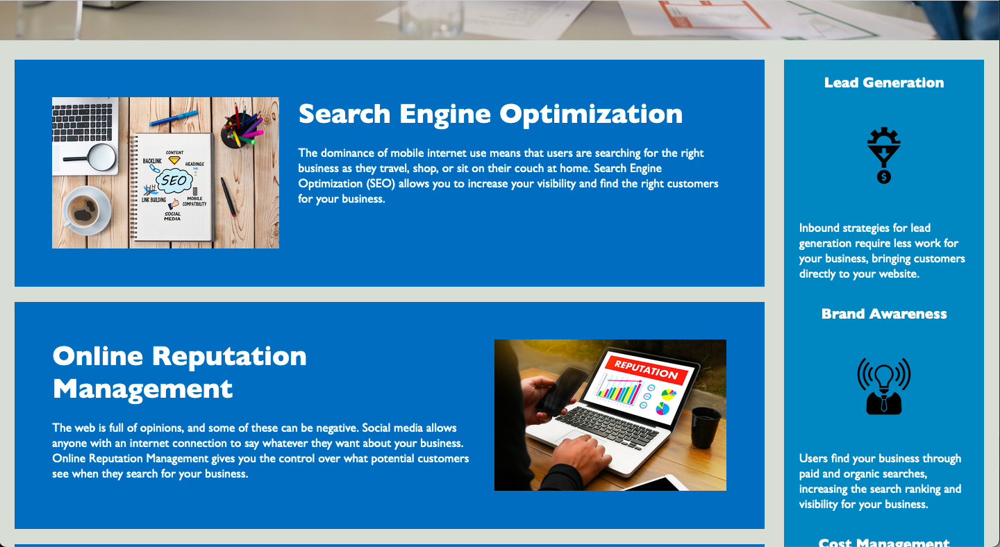
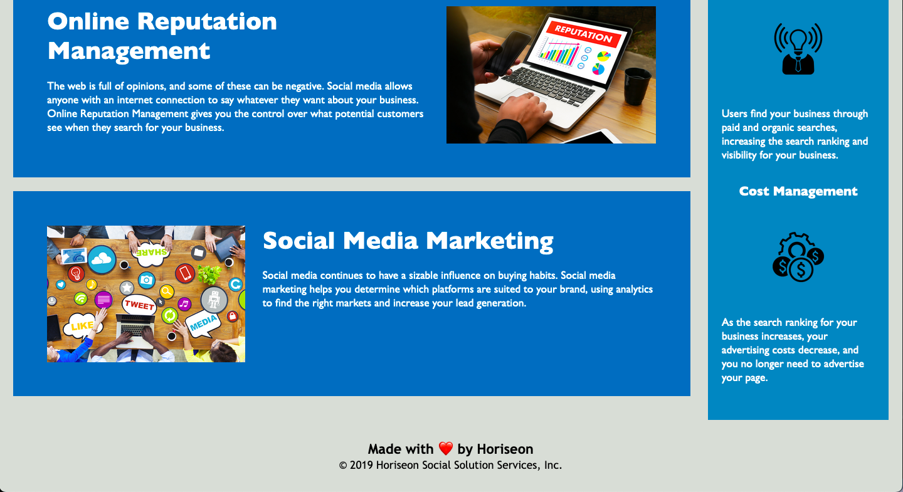

# Horiseon Project - Online marketing service

As a web developer I am responsible for refactoting an existing site as per client's requirements. The primary task will be to improve the site's readability, scalability, and performance while ensuring that it adheres to accessibility standards. This will involve analyzing the code, looking for opportunities to simplify and optimize it while eliminating and suplication and repetition.

## Observation

The motivation behind this project was to develop skills and knowledge, experiment with new technologies ans tools. Ulitmately the end goal is to meet the specific requirements an improve efficiency, quality or user experience.

I learned how to solve gaps and fix specific problems to enhance code. While also encountering a new observation on my workflow time that I need in order to work on a challenge.

## Overview

This HTML file is a basic website layout that showcases three services: Search Engine Optimization (SEO), Online Reputation Management, and Social Media Marketing. This website layout also includes a benefits section that describes features such as lead generation, brand awareness, and cost management which in terms will solve

- [Installation](#installation)
- [Usage](#usage)

## Installation

1. CLone the repository to your local machine.
2. Open the HTML file in web browser.

## Usage

index.html: This is the main html file for the page, which contains the structure of the page

assets/css/style.css: This is the style file for the page, which is included in the index.html file

assets/css/images: Images shown in the page, included in the index.html file

Here are some screenshots of the web site:

To run the website, go to the link: [ekvcode.github.io](https://github.com/ekvcode/ekvcode.github.io)

## Features

- Service descriptions for Search Engine Optimization (SEO), Online Reputation Management, and Social Media Marketing.
- Benefits section that provides a brief overview of lead generation, brand awareness, and cost management.
- Navigation bar to easily access each service.
